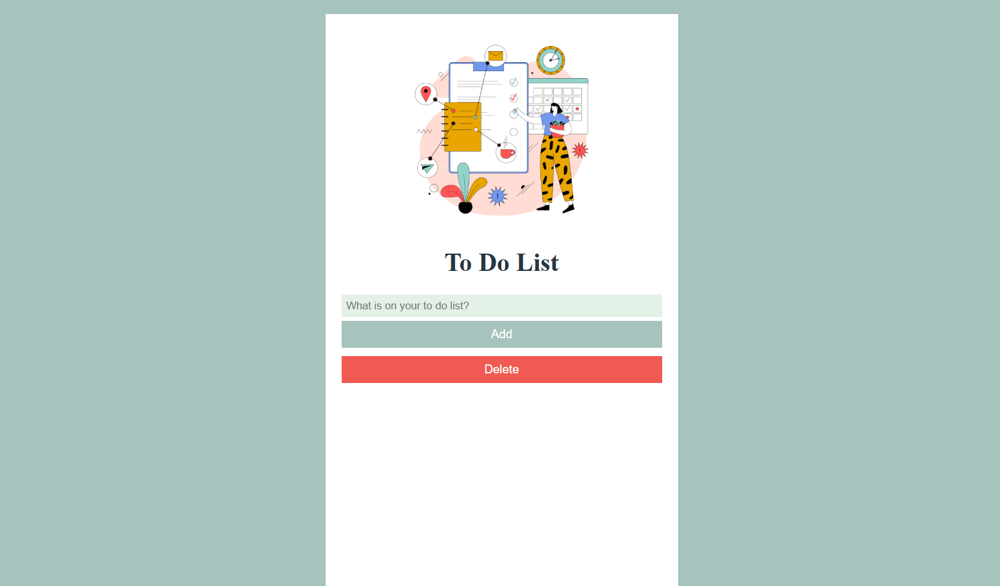

 To-Do List Application (React)
 
The To-Do List application is a simple and practical tool designed to help users organize their daily tasks more efficiently.  
It allows users to quickly add tasks, track their progress, and remove tasks once they are completed.

About the Application

This application provides an easy-to-use interface where users can create a list of tasks and manage them in real time.  
Tasks can be added through an input field, marked as completed, or deleted from the list when no longer needed.  
All changes are reflected instantly thanks to React state management.
The goal of this project was to practice building interactive user interfaces using React and to better understand how state and events work together in a real application.

Technologies Used
- React
- JavaScript (ES6+)
- HTML
- CSS
- Vite

Live demo:  

https://to-do-list-tasks-check.netlify.app/

Screenshot

Challenges and Learnings

One of the main challenges in this project was working with React state to update the UI dynamically.  
While building this application, I improved my understanding of React components, event handling, and managing application state using hooks.

How to Run the Project Locally

1. Clone the repository:
git clone https://github.com/ktrn-s/todo-app

2. Install dependencies:
npm install

3. Start the development server:
npm run dev
